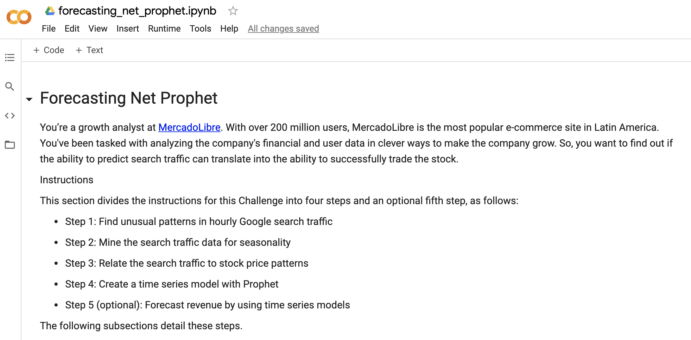
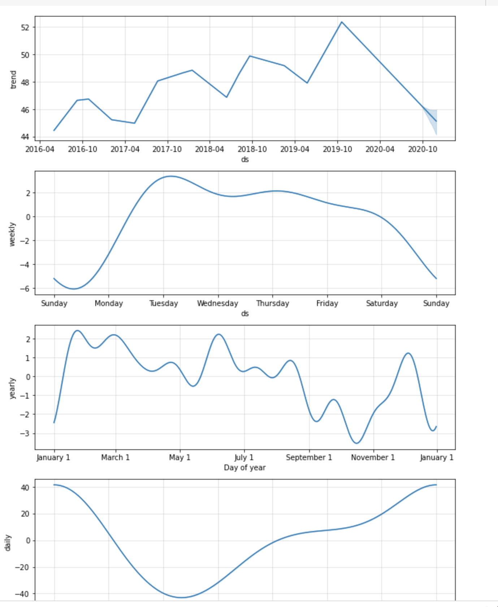
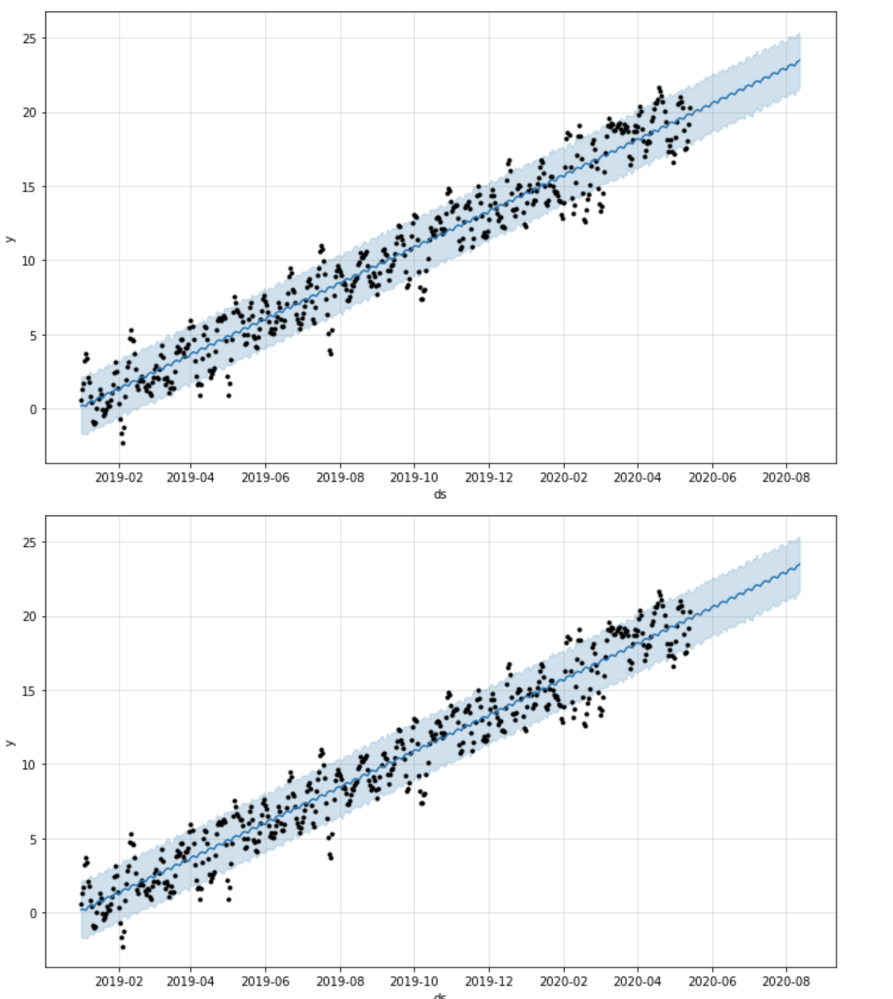
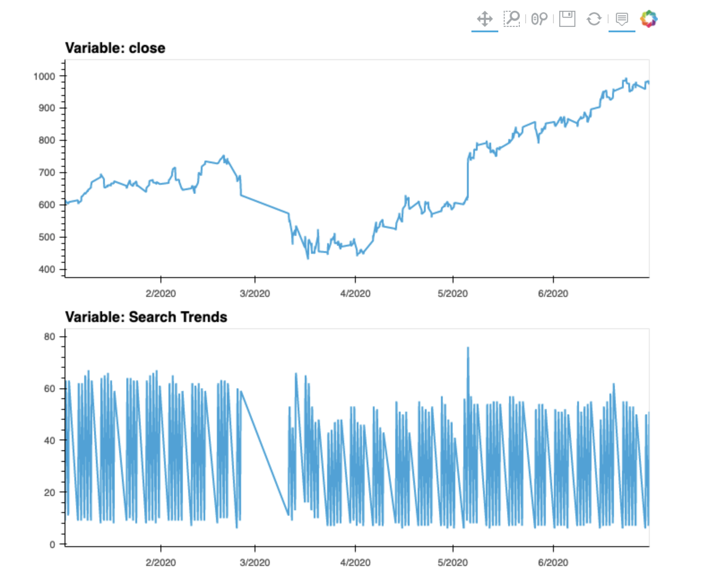

# Forecasting Net Prophet

---

This is a Google Colab created code used with the assitance of Pandas to create an analysis of the growth of MercadoLibre, a popular e-commerce site located in Latin America. The analysis was conducted with the help of google hourly search trends, mercado daily revenue, and mercados daily equity closing data.
## Technologies

This project uses python 3.7 with the following packages:

* [Pandas](https://github.com/pandas-dev/pandas) - Pandas is an open-source library that offers easy-to-use data analysis tools for Python.

* [FB Prophet](https://facebook.github.io/prophet/) - For interactive analysis using automated forecasts 

* [GOOGLE COLAB](https://colab.research.google.com/notebooks/intro.ipynb#recent=true) - For sofisticated analysis


 
---

## Installation Guide

Before running the application first install the following:


* [Install] Anaconda with Python 3.7+(https://docs.anaconda.com/anaconda/install/)
You should always be in a conda dev environment when launching JupyterLab.


* [Create] GOOGLE COLAB NOTEBOOK (https://account.mapbox.com/auth/signup/)


---

## Import the following libraries and dependencies 

```python
# Install the required libraries
from IPython.display import clear_output
try:
  !pip install pystan
  !pip install fbprophet
  !pip install hvplot
  !pip install holoviews
except:
  print("Error installing libraries")
finally:
  clear_output()
  print('Libraries successfully installed')

  # Import the required libraries and dependencies
import pandas as pd
import holoviews as hv
from fbprophet import Prophet
import hvplot.pandas
import datetime as dt
%matplotlib inline
```
---

## Usage

To view the forecasting_net_prophet.ipynb, open file via GOOGLE COLAB

Upon launching the GOOGLE COLAB NOTEBOOK you will be greeted with the following prompts.




As Well as the following Visualizations of trend analysis using hvplot and FB Prophet.








---

## Contributors

Brought to you by MartyCodes333 (martique.henton@gmail.com) with the help of 2021 UW FinTech Bootcamp Instructors, TA's and Fellow Classmates